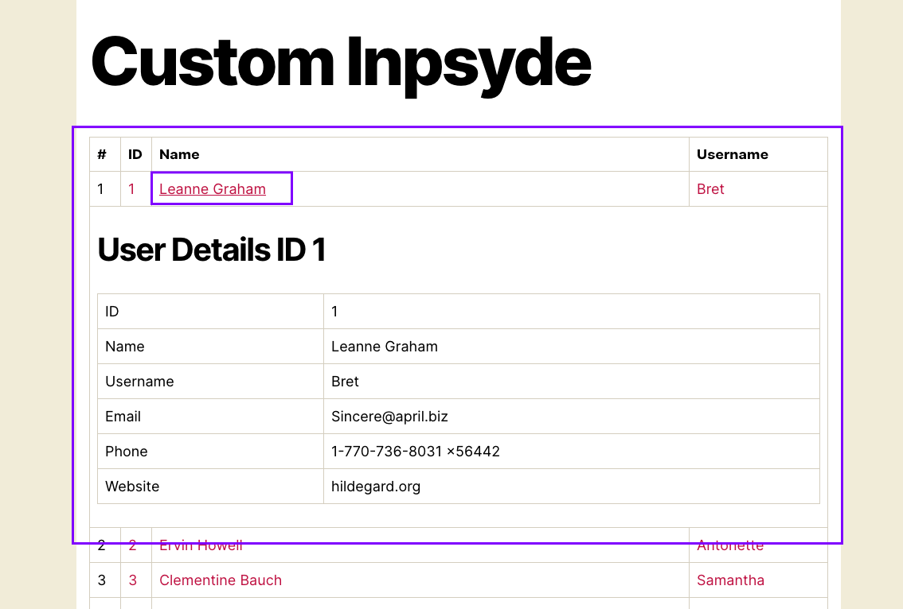

## Checklist from the requirements
-
```html
We ask you to write a WordPress plugin.
```
    
Repo is a WordPress plugin, to be honest, I found this https://github.com/inpsyde/paypal-plus-plugin from Inpsyde so I decided to learn from it. I include several docker containers in this plugin source code.

From https://github.com/npbtrac/test-inpsyde-plugin/blob/master/docker-compose.yml here
  - **mariadb**: is containter for database
  - **php**: for php-fpm instance, we mount the WordPress code and this plugin source code to it's plugin folder (this is a great idea, because previously, I created another repo to use composer to put this plugin to that folder, then I had to re-do my docker stuff following this wise approach).
  - **nginx**: for webserver
  - **composer**: for running composer stuff (because **php-fpm** has xdebug which make composer crazily slow).
  - **node**: for handling npm stuff to server task runners for producing css and js files.
  - **traefik**: this is new to me, I just copied from **Paypal Plus** plugin (will learn about that later).

Commands:
  - `docker-compose run --rm composer composer install --dev` for using composer instance to get all packages
  - `docker-compose exec php /opt/wp-install.sh` for install a fress WordPress instance
  - `docker-compose run --rm node npm install --save-dev` for installing all packages from npm to be able to use Webpack
  - `docker-compose run --rm node npm run dev` to produce js and css files.
  
-
```html
- When installed, the plugin has to make available a custom endpoint on the WordPress site. With “custom endpoint” we mean an arbitrary URL not recognized by WP as a standard URL, like a permalink or so.

  Note that this is not a REST endpoint.

- When a visitor navigates to that endpoint, the plugin has to send an HTTP request to a REST API endpoint. The API is available at https://jsonplaceholder.typicode.com and the endpoint to call is /users (https://jsonplaceholder.typicode.com/users) - **Done**

- The plugin will parse the JSON response and will use it to build and display an HTML table.
  If you want you can call this endpoint using AJAX, but that is optional.
``` 
- After running needed commands, user can navigate to http://test-inpsyde-plugin.docker/?pagename=custom-inpsyde
- When access this URL (a custom endpoint) http://test-inpsyde-plugin.docker/?pagename=custom-inpsyde, a list of records taken from https://jsonplaceholder.typicode.com/users (as json) would be pulled and appears for user to see. (not using ajax)
- I use a class as a service to retrieve remote data https://github.com/npbtrac/test-inpsyde-plugin/blob/master/src/Services/UserRemoteJsonService.php#L46
- This plugin use Laravel DI container https://github.com/npbtrac/test-inpsyde-plugin/blob/master/composer.json#L20 to store all needed services (for rendering, for getting remote data from json format).
- The goal of using DI container is to have ability to access the instance for this Plugin anywhere (after plugins loaded) by using `\TestInpsyde\Wp\Plugin\TestInpsyde::getInstance()` as a global instance. Therefore, you can access that instance and dependent services to get their attributes, methods or simply remove some hooks.
- The reason why I didn't use ajax for this is because this is the main endpoint, and it needs to show all needed data for SEO purpose.

-
```html
- Each row in the HTML table will show the details for a user. The column's id, name, and username are mandatory, but you can show more details if you want.
 
  The content of three mandatory columns must be a link (<a> tag). When a visitor clicks any of these links, the details of that user must be shown. For that, the plugin will do another API request to the user-details endpoint.
  
  See https://jsonplaceholder.typicode.com/guide.html for documentation.
  
  We don’t mind you to use any JavaScript, including 3rd party libraries, to improve the table look and feel. Things like client-side ordering and filtering, for example, are ok but not required.
  
- These details fetching requests must be asynchronous (AJAX) and the user details will be shown without reloading the page.
  At any time, the page will show details for at max one user. In fact, at every link click, a new user detail will load, replacing the one currently shown.
  
  This feature requires JavaScript, of course. You have the choice of technology to use. To make some examples, the code could be written in vanilla ES5 code, using 3rd party libraries like jQuery or whatnot, or implemented with vanilla modern JS, or TypeScript, React, Svelte, etc...

```
- Each row in the HTML table will show the details for a user. The column's id, name, and username are mandatory and display there.

- Clicking on link of ID, Name, Username, it would fire an ajax action to get details of thank clicked user. Ajax URL http://test-inpsyde-plugin.docker/wp-admin/admin-ajax.php?action=get_single_user&id=1 would use `admin-ajax.php`. I don't use `check_ajax_referer` because the ajax URL is a simple one for showing data, no special activities, so I skip the check referrer.
- Because clicking on ID, Name, Username would request to a same URL, so I use a variable to store the remote response to avoid making repeated remote requests to make things work faster (https://github.com/npbtrac/test-inpsyde-plugin/blob/master/assets/src/js/_custom-page.js#L28). You can see the clicked item is the one with underline

- Besides, I use server side caching (using transient) to avoid requesting too many time to remote data. (https://github.com/npbtrac/test-inpsyde-plugin/blob/master/src/Services/UserRemoteJsonService.php#L85)